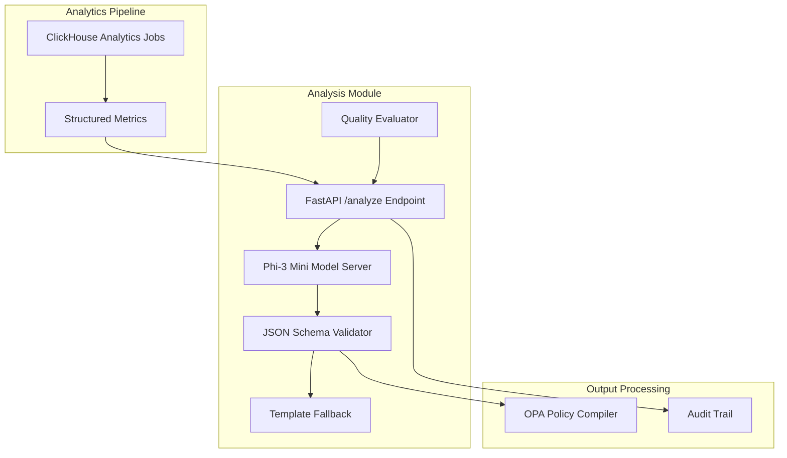

# Design Document

## Overview

The Analysis Module is a new microservice component that provides automated analysis of structured security metrics to generate concise explanations, remediations, and policy recommendations. It operates as a separate FastAPI service alongside the existing Llama Mapper, processing structured analytics data from ClickHouse queries to produce auditable insights for security analysts, operations engineers, and compliance officers.

The module follows a deterministic, template-fallback architecture using the Phi-3 Mini (3.8B) model for zero-shot inference, with built-in schema validation and quality monitoring to ensure reliable, consistent outputs.

## Architecture

### High-Level Architecture



### Service Integration

The Analysis Module integrates with the existing Llama Mapper ecosystem by:

- Sharing the same Docker/Helm deployment patterns
- Using the same configuration management system
- Leveraging shared monitoring and metrics infrastructure
- Following the same logging and audit trail patterns
- Maintaining consistent API response formats

## Components and Interfaces

### 1. Analysis API Service (`src/llama_mapper/analysis/`)

**Primary Interfaces:**

```python
@app.post("/analyze", response_model=AnalysisResponse)
async def analyze_metrics(request: AnalysisRequest) -> AnalysisResponse

@app.post("/analyze/batch", response_model=BatchAnalysisResponse)
async def analyze_metrics_batch(
    request: BatchAnalysisRequest,
    idempotency_key: str = Header(...)
) -> BatchAnalysisResponse
```

**Input Schema (AnalysisRequest):**
```python
class AnalysisRequest(BaseModel):
    period: str = Field(regex=r'^\d{4}-\d{2}-\d{2}T\d{2}:\d{2}:\d{2}Z/\d{4}-\d{2}-\d{2}T\d{2}:\d{2}:\d{2}Z$')
    tenant: str = Field(min_length=1, max_length=64)
    app: str = Field(min_length=1, max_length=64)
    route: str = Field(min_length=1, max_length=256)
    required_detectors: List[str] = Field(min_items=1, max_items=20)
    observed_coverage: Dict[str, float] = Field(description="Keys must match required_detectors, values 0.0-1.0")
    required_coverage: Dict[str, float] = Field(description="Keys must match required_detectors, values 0.0-1.0")
    detector_errors: Dict[str, Dict[str, Any]] = Field(description="Keys must match required_detectors")
    high_sev_hits: List[Dict[str, Any]] = Field(max_items=100)
    false_positive_bands: List[Dict[str, Any]] = Field(max_items=50)
    policy_bundle: str = Field(regex=r'^[a-zA-Z0-9\-\.]+$')
    env: Literal["dev", "stage", "prod"]

    @validator('observed_coverage', 'required_coverage')
    def validate_coverage_values(cls, v):
        for key, value in v.items():
            if not 0.0 <= value <= 1.0:
                raise ValueError(f"Coverage value {value} for {key} must be between 0.0 and 1.0")
        return v

# Allowed evidence reference IDs
ALLOWED_EVIDENCE_REFS = [
    "required_detectors", "observed_coverage", "required_coverage", 
    "detector_errors", "high_sev_hits", "false_positive_bands",
    "policy_bundle", "env", "period", "tenant", "app", "route"
]
```

**Output Schema (AnalysisResponse):**
```python
class VersionInfo(BaseModel):
    taxonomy: str
    frameworks: str
    analyst_model: str

class AnalysisResponse(BaseModel):
    reason: str = Field(max_length=120)
    remediation: str = Field(max_length=120)
    opa_diff: str = Field(max_length=2000)
    confidence: float = Field(ge=0.0, le=1.0)
    confidence_cutoff_used: float
    evidence_refs: List[str] = Field(min_items=1)
    notes: str = Field(max_length=500)
    version_info: VersionInfo
    request_id: str
    timestamp: datetime
    processing_time_ms: int

class BatchAnalysisRequest(BaseModel):
    requests: List[AnalysisRequest] = Field(min_items=1, max_items=100)
    
class BatchAnalysisResponse(BaseModel):
    responses: List[Union[AnalysisResponse, AnalysisErrorResponse]]
    batch_id: str
    idempotency_key: str
    total_processing_time_ms: int
    success_count: int
    error_count: int

class AnalysisErrorResponse(BaseModel):
    error_type: Literal["validation_error", "processing_error", "timeout_error", "confidence_fallback"]
    message: str
    request_id: str
    timestamp: datetime
    fallback_used: bool
    mode: Literal["error", "fallback"]
    template_response: Optional[AnalysisResponse]
```

### 2. Model Server (`src/llama_mapper/analysis/model_server.py`)

Extends the existing ModelServer pattern to support Phi-3 Mini:

```python
class AnalysisModelServer:
    def __init__(self, model_path: str, temperature: float = 0.1, confidence_cutoff: float = 0.3):
        self.model = self._load_phi3_model(model_path)
        self.temperature = temperature
        self.confidence_cutoff = confidence_cutoff
        self.version_info = self._load_version_info()
        
    async def analyze(self, structured_input: AnalysisRequest) -> Dict[str, Any]:
        """Generate analysis using Phi-3 Mini with structured prompts."""
        
    async def analyze_batch(self, requests: List[AnalysisRequest], idempotency_key: str) -> List[Dict[str, Any]]:
        """Process batch requests with idempotency support."""
        
    def _build_prompt(self, request: AnalysisRequest) -> str:
        """Build deterministic prompt from structured metrics."""
        
    def _parse_response(self, raw_output: str) -> Dict[str, Any]:
        """Parse and validate model output."""
        
    def _apply_confidence_governance(self, response: Dict[str, Any]) -> Dict[str, Any]:
        """Apply confidence cutoff and add governance metadata."""
        
    def _compute_confidence(self, model_output: str, metrics_quality: float) -> float:
        """Compute calibrated confidence score based on model certainty and input quality."""
        
    def _redact_pii(self, text: str) -> str:
        """Remove any potential PII from free-text fields."""
```

### 3. Schema Validator (`src/llama_mapper/analysis/validator.py`)

Reuses existing JSON validation patterns:

```python
class AnalysisValidator(JSONValidator):
    def __init__(self):
        super().__init__(schema_path="schemas/analyst_output.json")
        
    def validate_and_fallback(self, 
                            model_output: Dict[str, Any], 
                            request: AnalysisRequest) -> Dict[str, Any]:
        """Validate output, fallback to templates on failure."""
```

### 4. Template Fallback System (`src/llama_mapper/analysis/templates.py`)

```python
class AnalysisTemplates:
    def coverage_gap_template(self, request: AnalysisRequest) -> Dict[str, Any]:
        """Template for coverage gap scenarios."""
        
    def false_positive_template(self, request: AnalysisRequest) -> Dict[str, Any]:
        """Template for FP tuning scenarios."""
        
    def insufficient_data_template(self) -> Dict[str, Any]:
        """Template for insufficient metrics scenarios."""
```

### 5. OPA Policy Generator (`src/llama_mapper/analysis/opa_generator.py`)

```python
class OPAPolicyGenerator:
    def validate_rego(self, rego_snippet: str) -> bool:
        """Validate Rego syntax using OPA compiler."""
        
    def generate_coverage_policy(self, 
                               required_detectors: List[str],
                               thresholds: Dict[str, float]) -> str:
        """Generate coverage violation policies."""
        
    def generate_threshold_policy(self, 
                                detector: str, 
                                new_threshold: float) -> str:
        """Generate threshold adjustment policies."""
```

### 6. Quality Evaluator (`src/llama_mapper/analysis/evaluator.py`)

```python
class QualityEvaluator:
    def __init__(self, golden_dataset_path: str):
        self.golden_examples = self._load_golden_set()
        
    async def evaluate_batch(self, examples: List[Tuple[AnalysisRequest, AnalysisResponse]]) -> EvaluationMetrics:
        """Evaluate against golden dataset."""
        
    def calculate_drift_score(self, recent_outputs: List[AnalysisResponse]) -> float:
        """Calculate quality drift over time."""
```

## Data Models

### Core Analysis Types

```python
# Metrics input structures
class CoverageMetrics(BaseModel):
    required_detectors: List[str]
    observed_coverage: Dict[str, float]
    required_coverage: Dict[str, float]

class ErrorMetrics(BaseModel):
    detector_errors: Dict[str, Dict[str, Any]]
    high_sev_hits: List[Dict[str, Any]]

class FalsePositiveMetrics(BaseModel):
    false_positive_bands: List[Dict[str, Any]]

# Analysis context
class AnalysisContext(BaseModel):
    period: str
    tenant: str
    app: str
    route: str
    policy_bundle: str
    env: Literal["dev", "stage", "prod"]

# Idempotency and batch processing
class IdempotencyCache(BaseModel):
    key: str
    response: BatchAnalysisResponse
    created_at: datetime
    expires_at: datetime

class ConfidenceGovernance(BaseModel):
    cutoff: float
    fallback_to_template: bool
    record_in_response: bool
```

### Template Response Types

```python
class AnalysisType(Enum):
    COVERAGE_GAP = "coverage_gap"
    FALSE_POSITIVE_TUNING = "false_positive_tuning"
    INCIDENT_SUMMARY = "incident_summary"
    INSUFFICIENT_DATA = "insufficient_data"

class TemplateResponse(BaseModel):
    analysis_type: AnalysisType
    template_used: str
    fallback_reason: Optional[str]
```

## Error Handling

### Error Classification

1. **Input Validation Errors** (400)
   - Invalid metric formats
   - Missing required fields
   - Out-of-range values

2. **Model Processing Errors** (500)
   - Model inference failures
   - Timeout errors
   - Resource exhaustion

3. **Schema Validation Errors** (422)
   - Invalid JSON output from model
   - Schema constraint violations
   - Automatic fallback to templates

4. **OPA Compilation Errors** (422)
   - Invalid Rego syntax
   - Policy compilation failures
   - Fallback to empty opa_diff

### API Rate Limits and SLOs

**Rate Limits:**
- Single requests: 1000 req/min per tenant
- Batch requests: 100 req/min per tenant
- Global: 10,000 req/min across all tenants

**Latency SLOs:**
- CPU deployment: p95 ≤ 250ms
- GPU deployment: p95 ≤ 120ms
- Batch processing: p95 ≤ 2000ms for 100-item batches

**Error Codes:**
- 400: Invalid input schema or validation failure
- 422: Schema validation passed but confidence < cutoff (returns template fallback)
- 429: Rate limit exceeded
- 500: Internal processing error
- 503: Service unavailable (circuit breaker open)

## Testing Strategy

### Unit Testing

1. **Model Server Tests**
   - Prompt generation accuracy
   - Response parsing robustness
   - Temperature consistency

2. **Validator Tests**
   - Schema compliance validation
   - Fallback trigger conditions
   - Edge case handling

3. **Template Tests**
   - Template accuracy for known scenarios
   - Coverage of all analysis types
   - Deterministic output verification

### Integration Testing

1. **End-to-End API Tests**
   - Full request/response cycles
   - Error handling flows
   - Performance benchmarks

2. **OPA Integration Tests**
   - Policy compilation verification
   - Rego syntax validation
   - Policy effectiveness testing

### Quality Assurance Testing

1. **Golden Dataset Evaluation**
   - 150+ curated examples
   - Coverage, anomaly, and tuning scenarios
   - Human rubric scoring (4/5+ target)
   - Automated OPA compilation validation on all golden outputs

2. **Drift Detection Testing**
   - Weekly evaluation runs
   - Quality degradation alerts
   - Model performance tracking

3. **CI/CD OPA Validation**
   - Automated `opa check` on generated snippets from golden cases
   - Pre-deployment validation of policy generation
   - Regression testing for Rego syntax correctness
   - Fail CI/CD pipeline if any OPA snippet fails compilation

4. **PII Security Testing**
   - Unit tests for PII redaction on all free-text fields
   - Validation that no sensitive data leaks in notes or reason fields
   - Automated scanning for common PII patterns

### Performance Testing

1. **Load Testing**
   - Concurrent request handling
   - Response time targets (<500ms p95)
   - Resource utilization monitoring

2. **Canary Testing**
   - 10% traffic allocation
   - A/B comparison with templates
   - Gradual rollout validation

## Deployment Architecture

### Container Structure

```dockerfile
# Extends existing Llama Mapper base image
FROM llama-mapper-base:latest

# Add Phi-3 Mini model and analysis dependencies
COPY models/phi3-mini/ /app/models/
COPY src/llama_mapper/analysis/ /app/src/llama_mapper/analysis/
COPY schemas/analyst_output.json /app/schemas/

# Analysis-specific configuration
ENV ANALYSIS_MODEL_PATH=/app/models/phi3-mini
ENV ANALYSIS_TEMPERATURE=0.1
ENV FALLBACK_ENABLED=true
```

### Kubernetes Deployment

```yaml
# analysis-deployment.yaml
apiVersion: apps/v1
kind: Deployment
metadata:
  name: analysis-service
spec:
  replicas: 3
  template:
    spec:
      containers:
      - name: analysis
        image: llama-mapper-analysis:latest
        ports:
        - containerPort: 8001
        env:
        - name: SERVICE_NAME
          value: "analysis"
        resources:
          requests:
            memory: "4Gi"
            cpu: "1000m"
          limits:
            memory: "8Gi" 
            cpu: "2000m"
```

### Service Configuration

```yaml
# analysis-service.yaml
apiVersion: v1
kind: Service
metadata:
  name: analysis-service
spec:
  selector:
    app: analysis
  ports:
  - port: 80
    targetPort: 8001
  type: ClusterIP
```

### Canary Deployment Strategy

1. **Initial Deployment**: 10% traffic to analysis service
2. **Monitoring Phase**: 48-hour observation period
3. **Quality Gates**: 
   - Schema validation ≥98%
   - Response time <500ms p95
   - Error rate <1%
4. **Rollout**: Gradual increase to 100% over 1 week
5. **Kill Switch**: Immediate fallback to template responses

## Monitoring and Observability

### Metrics Collection

Extends existing MetricsCollector:

```python
class AnalysisMetricsCollector(MetricsCollector):
    def record_analysis_request(self, analysis_type: str, processing_time: float):
        """Record analysis request metrics."""
        
    def record_schema_validation(self, success: bool, fallback_used: bool):
        """Record validation success/failure rates."""
        
    def record_quality_score(self, rubric_score: float, drift_score: float):
        """Record quality evaluation metrics."""
```

### Key Performance Indicators

1. **Functional Metrics**
   - Schema validation success rate (target: ≥98%)
   - OPA compilation success rate (target: ≥95%)
   - Template fallback rate (target: <5%)

2. **Quality Metrics**
   - Human rubric scores (target: ≥4/5)
   - Weekly drift scores (alert: <3.7/5)
   - Evidence reference accuracy (target: 100%)

3. **Performance Metrics**
   - Response time p95 (target: <500ms)
   - Throughput (target: 100 req/sec)
   - Resource utilization (target: <80% CPU/memory)

### Alerting Strategy

1. **Critical Alerts**
   - Schema validation rate <95%
   - Service availability <99%
   - Quality drift score <3.7

2. **Warning Alerts**
   - Response time p95 >400ms
   - Template fallback rate >3%
   - OPA compilation failures >2%

3. **Info Alerts**
   - Daily quality report
   - Weekly drift analysis
   - Monthly golden dataset evaluation

### Alerting Acceptance Criteria

- **Schema Validation Alert**: Fire alert when schema-valid rate < 98% over 5-minute window
- **Fallback Rate Alert**: Fire alert when template fallback rate > 10% over 15-minute window  
- **Latency SLO Alert**: Fire alert when p95 latency exceeds SLO targets for 3 consecutive minutes
- **OPA Compilation Alert**: Fire alert immediately when any OPA snippet fails compilation in production