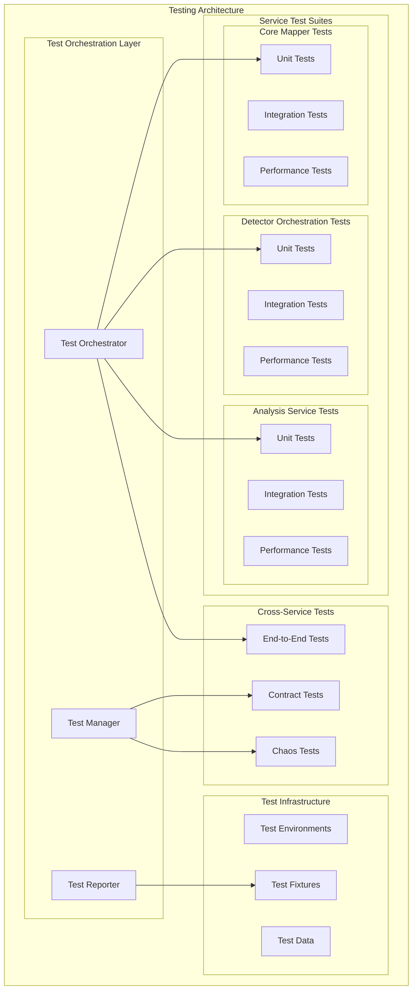
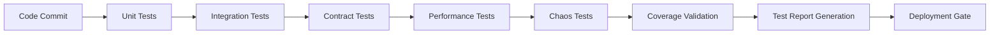

# Design Document

## Overview

This design document outlines a comprehensive testing strategy for the Llama Mapper system's three-service architecture: Core Mapper Service, Detector Orchestration Service, and Analysis Service. The design builds upon existing testing infrastructure while introducing standardized patterns, enhanced cross-service testing, and improved observability.

## Architecture

### Service Architecture Overview



### Testing Framework Hierarchy

The testing framework follows a hierarchical structure:

1. **Unit Tests**: Individual component testing within each service
2. **Integration Tests**: Service-internal component interaction testing
3. **Contract Tests**: API contract validation between services
4. **End-to-End Tests**: Complete workflow testing across all services
5. **Performance Tests**: Load, stress, and endurance testing
6. **Chaos Tests**: Fault tolerance and resilience testing

## Components and Interfaces

### 1. Test Framework Standardization Component

#### TestFrameworkManager
```python
class TestFrameworkManager:
    """Manages standardized testing patterns across all services."""
    
    def __init__(self, services: List[ServiceConfig]):
        self.services = services
        self.pytest_config = PytestConfig()
        self.fixture_registry = FixtureRegistry()
    
    def setup_service_tests(self, service: ServiceConfig) -> TestSuite:
        """Setup standardized test suite for a service."""
        pass
    
    def register_cross_service_fixtures(self) -> None:
        """Register fixtures for cross-service testing."""
        pass
```

#### StandardizedFixtures
```python
@pytest.fixture(scope="session")
def service_cluster():
    """Provides a complete service cluster for testing."""
    return ServiceCluster([
        CoreMapperService(),
        DetectorOrchestrationService(),
        AnalysisService()
    ])

@pytest.fixture(scope="function")
def isolated_service_mocks():
    """Provides isolated mocks for each service."""
    return {
        'mapper': MockMapperService(),
        'orchestration': MockOrchestrationService(),
        'analysis': MockAnalysisService()
    }
```

### 2. Multi-Service Test Coverage Component

#### CoverageAggregator
```python
class CoverageAggregator:
    """Aggregates coverage metrics across all services."""
    
    def __init__(self):
        self.service_coverage = {}
        self.cross_service_coverage = {}
    
    def collect_service_coverage(self, service: str) -> CoverageReport:
        """Collect coverage for individual service."""
        pass
    
    def collect_integration_coverage(self) -> IntegrationCoverageReport:
        """Collect coverage for cross-service interactions."""
        pass
    
    def generate_unified_report(self) -> UnifiedCoverageReport:
        """Generate unified coverage report across all services."""
        pass
```

#### TestCoverageValidator
```python
class TestCoverageValidator:
    """Validates test coverage meets requirements."""
    
    COVERAGE_THRESHOLDS = {
        'core_mapper': 0.85,
        'detector_orchestration': 0.85,
        'analysis_service': 0.85,
        'cross_service_integration': 0.90,
        'critical_paths': 0.95
    }
    
    def validate_coverage(self, report: UnifiedCoverageReport) -> ValidationResult:
        """Validate coverage meets threshold requirements."""
        pass
```

### 3. Performance Testing Framework

#### MultiServicePerformanceTester
```python
class MultiServicePerformanceTester:
    """Coordinates performance testing across all services."""
    
    def __init__(self):
        self.load_generators = {
            'locust': LocustLoadGenerator(),
            'k6': K6LoadGenerator(),
            'artillery': ArtilleryLoadGenerator()
        }
    
    def run_service_performance_test(self, service: str, config: PerformanceConfig) -> PerformanceResult:
        """Run performance test for individual service."""
        pass
    
    def run_cross_service_performance_test(self, config: CrossServicePerformanceConfig) -> CrossServicePerformanceResult:
        """Run performance test across service boundaries."""
        pass
```

#### PerformanceMetricsCollector
```python
class PerformanceMetricsCollector:
    """Collects and analyzes performance metrics."""
    
    SERVICE_SLA_TARGETS = {
        'core_mapper': {'p95_latency_ms': 100, 'throughput_rps': 1000},
        'detector_orchestration': {'p95_latency_ms': 200, 'throughput_rps': 500},
        'analysis_service': {'p95_latency_ms': 500, 'throughput_rps': 100}
    }
    
    def collect_metrics(self, service: str, duration: int) -> ServiceMetrics:
        """Collect performance metrics for service."""
        pass
    
    def validate_sla_compliance(self, metrics: ServiceMetrics) -> SLAValidationResult:
        """Validate metrics against SLA targets."""
        pass
```

### 4. Cross-Service Integration Testing

#### ServiceContractTester
```python
class ServiceContractTester:
    """Tests API contracts between services."""
    
    def __init__(self):
        self.contract_registry = ContractRegistry()
        self.pact_broker = PactBroker()
    
    def validate_mapper_orchestration_contract(self) -> ContractValidationResult:
        """Validate contract between Mapper and Orchestration services."""
        pass
    
    def validate_orchestration_analysis_contract(self) -> ContractValidationResult:
        """Validate contract between Orchestration and Analysis services."""
        pass
```

#### EndToEndWorkflowTester
```python
class EndToEndWorkflowTester:
    """Tests complete workflows across all services."""
    
    def test_detection_to_analysis_workflow(self, test_case: WorkflowTestCase) -> WorkflowResult:
        """Test complete detection → mapping → analysis workflow."""
        pass
    
    def test_batch_processing_workflow(self, batch_size: int) -> BatchWorkflowResult:
        """Test batch processing across services."""
        pass
```

### 5. Chaos Engineering Framework

#### ChaosTestOrchestrator
```python
class ChaosTestOrchestrator:
    """Orchestrates chaos engineering tests across services."""
    
    def __init__(self):
        self.chaos_scenarios = ChaosScenarioRegistry()
        self.failure_injector = FailureInjector()
    
    def inject_service_failure(self, service: str, failure_type: FailureType) -> ChaosTestResult:
        """Inject failure into specific service."""
        pass
    
    def inject_network_partition(self, services: List[str]) -> NetworkPartitionResult:
        """Inject network partition between services."""
        pass
    
    def test_cascading_failure_prevention(self) -> CascadingFailureResult:
        """Test system's ability to prevent cascading failures."""
        pass
```

### 6. Test Environment Management

#### MultiServiceTestEnvironment
```python
class MultiServiceTestEnvironment:
    """Manages test environments for all services."""
    
    def __init__(self):
        self.docker_compose = DockerComposeManager()
        self.service_discovery = TestServiceDiscovery()
        self.database_manager = TestDatabaseManager()
    
    def provision_isolated_environment(self, test_id: str) -> TestEnvironment:
        """Provision isolated test environment."""
        pass
    
    def setup_service_mesh(self, services: List[str]) -> ServiceMesh:
        """Setup service mesh for integration testing."""
        pass
    
    def cleanup_environment(self, test_id: str) -> None:
        """Clean up test environment resources."""
        pass
```

## Data Models

### Test Configuration Models

```python
@dataclass
class ServiceTestConfig:
    """Configuration for service-specific testing."""
    service_name: str
    test_types: List[TestType]
    coverage_threshold: float
    performance_targets: Dict[str, float]
    dependencies: List[str]

@dataclass
class CrossServiceTestConfig:
    """Configuration for cross-service testing."""
    services: List[str]
    workflow_scenarios: List[WorkflowScenario]
    contract_specifications: List[ContractSpec]
    chaos_scenarios: List[ChaosScenario]

@dataclass
class TestEnvironmentConfig:
    """Configuration for test environments."""
    environment_type: EnvironmentType
    services: List[ServiceConfig]
    databases: List[DatabaseConfig]
    networking: NetworkConfig
    resource_limits: ResourceLimits
```

### Test Result Models

```python
@dataclass
class UnifiedTestResult:
    """Unified test result across all services."""
    test_id: str
    timestamp: datetime
    service_results: Dict[str, ServiceTestResult]
    integration_results: CrossServiceTestResult
    performance_results: PerformanceTestResult
    coverage_report: UnifiedCoverageReport
    status: TestStatus

@dataclass
class ServiceTestResult:
    """Test result for individual service."""
    service_name: str
    unit_test_results: UnitTestResult
    integration_test_results: IntegrationTestResult
    coverage_percentage: float
    performance_metrics: ServiceMetrics

@dataclass
class CrossServiceTestResult:
    """Test result for cross-service interactions."""
    contract_validation_results: List[ContractValidationResult]
    end_to_end_test_results: List[WorkflowResult]
    chaos_test_results: List[ChaosTestResult]
```

## Error Handling

### Test Failure Management

```python
class TestFailureHandler:
    """Handles test failures and provides diagnostics."""
    
    def handle_service_test_failure(self, failure: ServiceTestFailure) -> FailureReport:
        """Handle failure in service-specific tests."""
        return FailureReport(
            failure_type=failure.type,
            affected_service=failure.service,
            root_cause_analysis=self.analyze_root_cause(failure),
            remediation_steps=self.generate_remediation_steps(failure)
        )
    
    def handle_cross_service_failure(self, failure: CrossServiceFailure) -> CrossServiceFailureReport:
        """Handle failure in cross-service tests."""
        return CrossServiceFailureReport(
            affected_services=failure.services,
            interaction_point=failure.interaction_point,
            failure_propagation=self.analyze_failure_propagation(failure)
        )
```

### Test Environment Error Recovery

```python
class TestEnvironmentRecovery:
    """Handles test environment failures and recovery."""
    
    def recover_from_service_crash(self, service: str) -> RecoveryResult:
        """Recover from service crash during testing."""
        pass
    
    def recover_from_database_failure(self, database: str) -> RecoveryResult:
        """Recover from database failure during testing."""
        pass
    
    def recover_from_network_partition(self) -> RecoveryResult:
        """Recover from network partition during testing."""
        pass
```

## Testing Strategy

### Test Execution Pipeline



### Test Categories and Execution Order

1. **Fast Feedback Loop** (< 5 minutes)
   - Unit tests for all services
   - Basic integration tests
   - Contract validation tests

2. **Comprehensive Validation** (< 30 minutes)
   - Full integration test suite
   - Cross-service workflow tests
   - Security and privacy tests

3. **Performance Validation** (< 60 minutes)
   - Load testing for individual services
   - Cross-service performance tests
   - Endurance testing (subset)

4. **Resilience Validation** (< 90 minutes)
   - Chaos engineering tests
   - Fault tolerance validation
   - Recovery testing

### Test Data Strategy

```python
class TestDataManager:
    """Manages test data across all services."""
    
    def __init__(self):
        self.golden_datasets = GoldenDatasetRegistry()
        self.synthetic_generator = SyntheticDataGenerator()
        self.privacy_scrubber = PrivacyDataScrubber()
    
    def generate_cross_service_test_data(self, scenario: TestScenario) -> TestDataSet:
        """Generate test data for cross-service scenarios."""
        pass
    
    def create_tenant_isolated_data(self, tenant_id: str) -> TenantTestData:
        """Create tenant-specific test data."""
        pass
```

### Continuous Testing Integration

The testing strategy integrates with CI/CD pipelines through:

1. **Pre-commit Hooks**: Fast unit tests and linting
2. **Pull Request Validation**: Integration and contract tests
3. **Staging Deployment**: Performance and chaos tests
4. **Production Deployment**: Smoke tests and health checks

This design ensures comprehensive testing coverage across all three services while maintaining development velocity and system reliability.