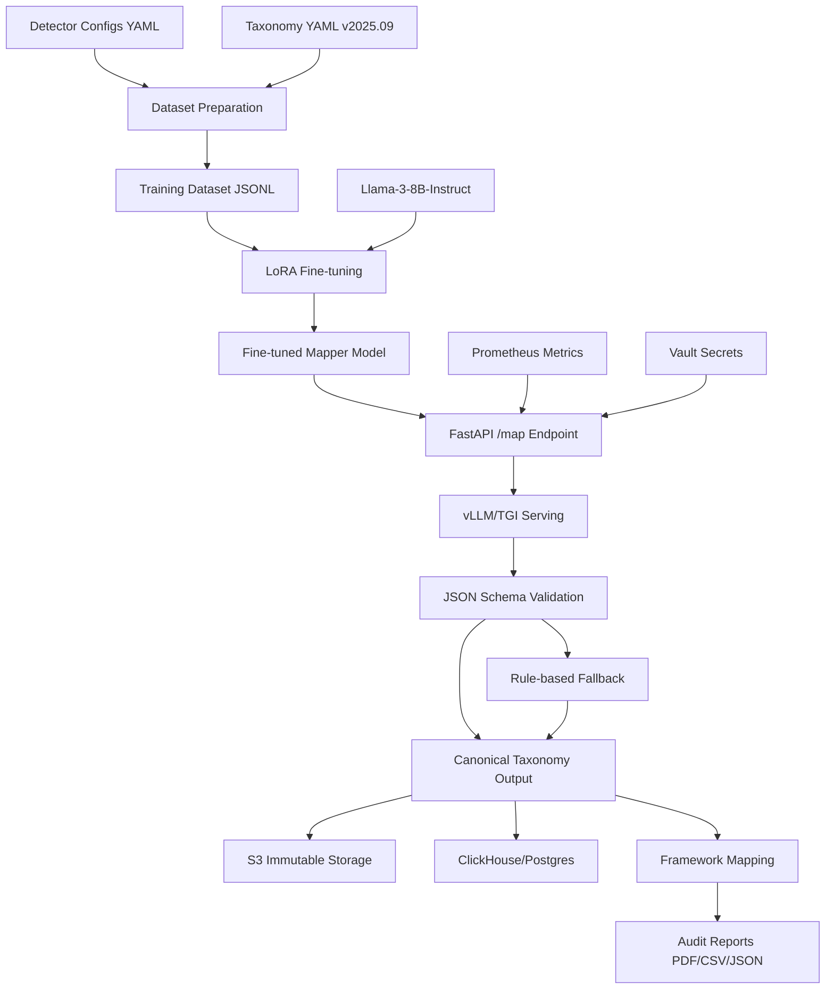

# Design Document

## Overview

The Llama Mapper Fine-tuning system is a privacy-first, audit-ready service that normalizes raw detector outputs into a canonical taxonomy for compliance evidence generation. The system consists of four main components: a dataset preparation pipeline, a LoRA fine-tuning pipeline for Llama-3-8B-Instruct, a FastAPI serving layer with JSON validation, and a comprehensive storage and reporting infrastructure. The system is designed to be deterministic, with all outputs matching a strict schema, and includes framework mapping for SOC 2, ISO 27001, and HIPAA compliance.

## Architecture



The architecture follows a microservices pattern with clear separation between data preparation, model training, API serving, storage, and reporting. The FastAPI service acts as the central orchestrator, handling requests through the fine-tuned model with comprehensive fallback, storage, and audit capabilities.

## Components and Interfaces

### Dataset Preparation Component

**Purpose:** Convert detector mappings into instruction-following training data

**Key Classes:**
- `TaxonomyLoader`: Loads and validates taxonomy.yaml structure
- `DetectorConfigLoader`: Loads detector YAML files from pillars-detectors/ directory  
- `TrainingDataGenerator`: Creates instruction-response pairs for fine-tuning
- `SyntheticDataGenerator`: Generates synthetic examples (PII patterns, jailbreak prompts) for balanced training
- `DatasetValidator`: Ensures mapping consistency and completeness

**Input Format (Existing):**
```yaml
# pillars-detectors/deberta-toxicity.yaml
detector: deberta-toxicity
version: "v1"
notes: "Mapping for DeBERTa/Jigsaw-style toxicity outputs."
maps:
  toxic: HARM.SPEECH.Toxicity
  severe_toxic: HARM.SPEECH.Toxicity
  obscene: HARM.SPEECH.Obscenity
  insult: HARM.SPEECH.Insult
  threat: HARM.SPEECH.Threat
  identity_hate: HARM.SPEECH.Hate.Other
```

**Training Data Output Format:**
```json
{
  "instruction": "Map the following detector output to the canonical taxonomy. Detector: deberta-toxicity, Output: toxic",
  "response": "{\"taxonomy\": [\"HARM.SPEECH.Toxicity\"], \"scores\": {\"HARM.SPEECH.Toxicity\": 0.95}, \"confidence\": 0.95, \"provenance\": {\"detector\": \"deberta-toxicity\"}}"
}
```

### Fine-tuning Component

**Purpose:** Apply LoRA fine-tuning to Llama-3-8B-Instruct

**Key Classes:**
- `LoRATrainer`: Manages LoRA configuration and training loop
- `ModelLoader`: Loads base Llama-3-8B-Instruct model
- `TrainingConfig`: Encapsulates hyperparameters (r=16, α=32, lr=2e-4)
- `CheckpointManager`: Handles model saving and loading

**LoRA Configuration:**
- Rank (r): 16 - balances parameter efficiency with expressiveness
- Alpha (α): 32 - scaling factor for LoRA weights  
- Learning Rate: 2e-4 - conservative rate for instruction following
- Target Modules: Query, Key, Value projection layers
- Sequence Length: 1-2k tokens - sufficient for detector mapping context

### FastAPI Service Component

**Purpose:** Serve fine-tuned model through REST API with comprehensive validation and storage

**Key Classes:**
- `MapperAPI`: FastAPI application with /map endpoint
- `ModelServer`: Interface to vLLM/TGI serving backend
- `JSONValidator`: Validates output against pillars-detectors/schema.json
- `FallbackMapper`: Rule-based mapping when model confidence <0.6
- `StorageManager`: Handles S3 and database persistence
- `MetricsCollector`: Prometheus metrics collection
- `SecretsManager`: Vault/AWS Secrets Manager integration
- `ConfidenceEvaluator`: Calculates confidence using model logit softmax probability with calibrated thresholds
- `TenantIsolationManager`: Ensures tenant-scoped data access and prevents cross-tenant queries
- `TaxonomyMigrator`: Handles migration between taxonomy versions with automated label remapping
- `ConfigManager`: Manages YAML-configurable settings including confidence thresholds

**API Specification:**
```python
@app.post("/map")
async def map_detector_output(request: DetectorRequest) -> MappingResponse:
    """
    Maps detector output to canonical taxonomy
    - Input: detector name, raw output, optional metadata
    - Output: canonical label, confidence, framework mappings
    - Fallback: YAML rules if confidence <0.6
    """
```

**Generation Parameters:**
- Temperature: 0.0-0.2 - deterministic mapping
- Top-p: 0.9 - nucleus sampling for quality
- Max New Tokens: 200 - sufficient for JSON response
- Schema Validation: Strict adherence to schema.json

## Data Models

### Taxonomy Schema

```python
@dataclass
class TaxonomyLabel:
    name: str  # e.g., "HARM.SPEECH.Toxicity"
    description: str
    aliases: List[str]
    category: str  # Top-level category (PII, HARM, etc.)

@dataclass
class Taxonomy:
    version: str
    namespace: str
    labels: List[TaxonomyLabel]
    
    def get_label_by_name(self, name: str) -> Optional[TaxonomyLabel]
    def get_labels_by_category(self, category: str) -> List[TaxonomyLabel]
```

### Detector Mapping Schema

```python
@dataclass
class DetectorMapping:
    detector: str
    maps: Dict[str, str]  # original_label -> canonical_label
    
    def validate_against_taxonomy(self, taxonomy: Taxonomy) -> bool
    def get_canonical_label(self, original_label: str) -> Optional[str]
```

### Model Response Schema (Based on pillars-detectors/schema.json)

```python
@dataclass
class MapperCanonicalEvent:
    taxonomy: List[str]  # e.g., ["HARM.SPEECH.Toxicity"]
    scores: Dict[str, float]  # taxonomy_label -> normalized_score [0,1]
    confidence: float  # model-calibrated confidence [0,1]
    notes: Optional[str] = None  # debugging info, max 500 chars
    provenance: Optional[Provenance] = None
    policy_context: Optional[PolicyContext] = None
    
    def validate_schema(self) -> bool
    def to_json(self) -> str

@dataclass
class Provenance:
    vendor: Optional[str] = None
    detector: Optional[str] = None
    detector_version: Optional[str] = None
    raw_ref: Optional[str] = None  # pointer to raw event in S3/logs
    route: Optional[str] = None
    model: Optional[str] = None
    tenant_id: Optional[str] = None
    ts: Optional[datetime] = None

@dataclass
class PolicyContext:
    expected_detectors: Optional[List[str]] = None
    environment: Optional[str] = None  # dev, stage, prod
```

### Storage Schema

```python
@dataclass
class StorageRecord:
    tenant_id: str
    detector_type: str
    canonical_label: str
    confidence: float
    framework_mappings: List[str]
    timestamp: datetime
    # Note: Raw detector input NOT stored for privacy
```

## Error Handling

### Model Generation Failures

**Strategy:** Multi-tier fallback with retry logic

1. **Primary:** Fine-tuned model with JSON schema validation
2. **Retry:** Adjust generation parameters (increase temperature slightly)
3. **Fallback:** Rule-based mapping using detector YAML configurations
4. **Ultimate:** Assign OTHER.Unknown with confidence 0.0

**Implementation:**
```python
def map_detector_output(detector: str, label: str) -> MappingResponse:
    try:
        # Primary: Fine-tuned model
        response = model.generate(create_prompt(detector, label))
        if validate_json_schema(response):
            return parse_response(response)
    except Exception as e:
        log_model_error(e)
    
    # Fallback: Rule-based mapping
    return fallback_mapper.map(detector, label)
```

### Data Validation Errors

**Strategy:** Fail-fast validation with detailed error reporting

- Taxonomy validation: Ensure all referenced labels exist
- Detector config validation: Check mapping completeness
- Training data validation: Verify instruction-response format consistency

### Serving Infrastructure Errors

**Strategy:** Graceful degradation with monitoring

- Model loading failures: Fall back to rule-based mapping entirely
- Memory constraints: Automatic quantization fallback
- Request timeout: Return cached mapping if available

## Testing Strategy

### Unit Testing

**Dataset Preparation:**
- Test taxonomy loading with valid/invalid YAML
- Test detector config parsing and validation
- Test training data generation format consistency
- Test mapping validation against taxonomy

**Fine-tuning:**
- Test LoRA configuration setup
- Test training loop with synthetic data
- Test checkpoint saving/loading
- Test model convergence metrics

**Serving:**
- Test JSON schema validation with various inputs
- Test fallback mechanism triggering
- Test confidence score calculation
- Test batch processing functionality

### Integration Testing

**End-to-End Pipeline:**
- Test complete flow from detector configs to trained model
- Test serving pipeline with real detector outputs
- Test fallback behavior under various failure conditions
- Test performance with different quantization settings

**Model Quality Testing:**
- Test mapping accuracy on held-out detector outputs
- Test consistency across similar detector labels
- Test handling of edge cases and unknown labels
- Test confidence calibration accuracy

### Performance Testing

**Throughput Testing:**
- Measure requests per second under various loads
- Test batch processing efficiency
- Test memory usage with different model configurations
- Test latency with GPU vs CPU serving

**Scalability Testing:**
- Test model serving under concurrent requests
- Test dataset preparation with large detector sets
- Test fine-tuning time with various dataset sizes
- Test quantization impact on accuracy and speed

## Deployment Considerations

### Containerized Deployment

**Docker Image:**
- Base: Python 3.11 with FastAPI and Hugging Face stack
- Multi-stage build for optimized production image
- Health checks and graceful shutdown handling

**Helm Chart:**
- ConfigMaps for taxonomy.yaml and detector configs
- Secrets for model weights and API keys
- HPA (Horizontal Pod Autoscaler) configuration
- Service mesh integration (Istio/Linkerd)

**Scaling Strategy:**
- Start: 1-2 replicas for initial deployment
- Auto-scaling: Based on request rate and latency
- Resource limits: CPU/memory based on serving backend

### Model Serving Options

**GPU Deployment (Production):**
- vLLM for high-throughput serving (P95 ≤120ms)
- FP16 precision for memory efficiency
- Tensor parallelism for large batch sizes

**CPU Deployment (Development/Budget):**
- TGI (Text Generation Inference) support (P95 ≤250ms)
- 8-bit quantization (AWQ/GGUF) for memory reduction
- Batch request processing for efficiency

### Storage Architecture

**S3 Immutable Storage:**
- WORM (Write Once Read Many) configuration
- 90-day hot storage, 1-year cold storage lifecycle
- Cross-region replication for disaster recovery
- AES256-KMS encryption with BYOK support

**Hot Data Storage:**
- ClickHouse for analytics queries and reporting
- PostgreSQL for transactional operations
- 90-day retention with automated cleanup
- Read replicas for report generation

### Security and Privacy

**Data Protection:**
- No raw detector inputs persisted (privacy-first)
- Metadata-only logging (tenant ID, detector type, taxonomy hit)
- AES256 encryption at rest and in transit
- RBAC for API access and data queries

**Secrets Management:**
- Hashicorp Vault or AWS Secrets Manager
- Automatic secret rotation
- Least-privilege access principles
- Audit logging for secret access

### Framework Integration

**Compliance Mapping (Existing pillars-detectors/frameworks.yaml):**
```yaml
# frameworks.yaml v1.0
version: "v1.0"
frameworks:
  SOC2:
    CC7.2: "Monitors system components and detects anomalies"
  ISO27001:
    A.12.4.1: "Event logging"
  HIPAA:
    164.308(a): "Security management process (risk analysis & management)"

mappings:
  PII.Identifier.SSN: [ "SOC2:CC7.2", "ISO27001:A.12.4.1", "HIPAA:164.308(a)" ]
  HARM.SPEECH.Toxicity: [ "SOC2:CC7.2", "ISO27001:A.12.4.1" ]
  JAILBREAK.Attempt: [ "SOC2:CC7.2", "ISO27001:A.12.4.1" ]
```

**Report Generation:**
- PDF reports via WeasyPrint (auditor-facing) with embedded version tags
- CSV exports via Pandas (engineer-facing) with version metadata
- JSON API responses (integration-facing) with version headers
- Automated report scheduling and delivery
- Framework expansion process: approval workflow → frameworks.yaml version bump → deployment

### Monitoring and Observability

**Quality Gates (CI/CD):**
- Schema-valid outputs ≥95%
- Taxonomy F1 score ≥90%
- P95 latency ≤250ms CPU / ≤120ms GPU
- Golden test cases ≥100 per detector covering ≥80% of taxonomy categories
- Confidence calibration accuracy within 5% of true probability

**Prometheus Metrics:**
- Request count and rate
- Schema validation success rate
- Fallback usage percentage
- Response latency percentiles (P50, P95, P99)
- Model memory and CPU utilization

**Alerting Thresholds:**
- Fallback usage >10%
- Schema validation failures >5%
- P95 latency exceeding SLA
- Model serving errors >1%

**Operational Runbooks:**
- Adding new detectors: data pipeline automation
- Model rollback: canary deployment with feature flags
- Performance tuning: quantization and batch size optimization
- Incident response: automated failover to rule-based mapping