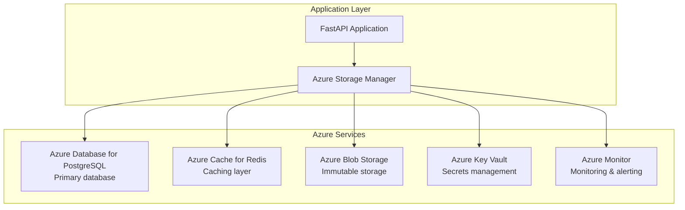

# Azure Multi-Database Architecture Documentation

This directory contains comprehensive documentation for the Azure-native **multi-database architecture** used in the Comply-AI platform.

## Architecture Overview

The Comply-AI platform uses a **three-database architecture** for optimal security, performance, and scalability:

```
┌─────────────────────────────────────────────────────────────┐
│                    Azure Database for PostgreSQL            │
├─────────────────────────────────────────────────────────────┤
│  ┌─────────────────┐  ┌─────────────────┐  ┌─────────────────┐ │
│  │   Core Database │  │  Billing DB     │  │  Analytics DB   │ │
│  │                 │  │                 │  │                 │ │
│  │ • Users         │  │ • Subscriptions │  │ • Usage Metrics │ │
│  │ • Tenants       │  │ • Invoices      │  │ • Performance   │ │
│  │ • Storage       │  │ • Payments      │  │ • Reports       │ │
│  │ • Audit Logs    │  │ • White-Glove   │  │ • Dashboards    │ │
│  │ • Configs       │  │ • Services      │  │ • ML Metrics    │ │
│  │ • Support       │  │ • Training      │  │ • Support       │ │
│  │ • Knowledge     │  │ • SLA Tracking  │  │ • Customer      │ │
│  │ • API Keys      │  │ • Satisfaction  │  │   Success       │ │
│  └─────────────────┘  └─────────────────┘  └─────────────────┘ │
└─────────────────────────────────────────────────────────────┘
```

### Database Breakdown

- **Core Database** (`comply-ai-core`) - 30 tables: Application data, service operations, support, knowledge base, API keys
- **Billing Database** (`comply-ai-billing`) - 18 tables: Subscriptions, payments, white-glove services, training, SLA tracking
- **Analytics Database** (`comply-ai-analytics`) - 23 tables: Usage metrics, performance data, reporting, support metrics, customer success

## Files Overview

### Core Documentation
- **[azure-database-schema.md](./azure-database-schema.md)** - Complete multi-database schema documentation
- **[azure-deployment-schema.sql](./azure-deployment-schema.sql)** - SQL script for database deployment
- **[azure-storage-manager.py](./azure-storage-manager.py)** - Python implementation of Azure storage manager
- **[azure-models.py](./azure-models.py)** - Data models and configuration classes

### Service-Specific Documentation
- **[white-glove-service-guide.md](./white-glove-service-guide.md)** - White-glove service management guide
- **[stripe-integration-guide.md](./stripe-integration-guide.md)** - Stripe billing integration guide

### Multi-Database Schema Files
- **[schemas/core-schema.sql](./schemas/core-schema.sql)** - Core database schema (users, tenants, storage, audit logs)
- **[schemas/billing-schema.sql](./schemas/billing-schema.sql)** - Billing database schema (subscriptions, payments, white-glove services)
- **[schemas/analytics-schema.sql](./schemas/analytics-schema.sql)** - Analytics database schema (metrics, reports, Azure infrastructure)
- **[multi-database-manager.py](./multi-database-manager.py)** - Python implementation for multi-database management

## Quick Start

### 1. Deploy Multi-Database Schema

```bash
# Deploy Core Database
psql -h comply-ai-core-db.postgres.database.azure.com \
     -U core_admin \
     -d comply-ai-core \
     -f schemas/core-schema.sql

# Deploy Billing Database  
psql -h comply-ai-billing-db.postgres.database.azure.com \
     -U billing_admin \
     -d comply-ai-billing \
     -f schemas/billing-schema.sql

# Deploy Analytics Database
psql -h comply-ai-analytics-db.postgres.database.azure.com \
     -U analytics_admin \
     -d comply-ai-analytics \
     -f schemas/analytics-schema.sql
```

### 2. Configure Multi-Database Environment Variables

```bash
# Core Database Configuration
export CORE_DB_HOST=comply-ai-core-db.postgres.database.azure.com
export CORE_DB_USER=core_admin
export CORE_DB_PASSWORD=your_core_db_password
export CORE_DB_NAME=comply-ai-core

# Billing Database Configuration
export BILLING_DB_HOST=comply-ai-billing-db.postgres.database.azure.com
export BILLING_DB_USER=billing_admin
export BILLING_DB_PASSWORD=your_billing_db_password
export BILLING_DB_NAME=comply-ai-billing

# Analytics Database Configuration
export ANALYTICS_DB_HOST=comply-ai-analytics-db.postgres.database.azure.com
export ANALYTICS_DB_USER=analytics_admin
export ANALYTICS_DB_PASSWORD=your_analytics_db_password
export ANALYTICS_DB_NAME=comply-ai-analytics
export LLAMA_MAPPER_STORAGE__DB_PASSWORD=YourSecurePassword123!
export LLAMA_MAPPER_STORAGE__DB_NAME=llama_mapper

# Azure Blob Storage
export LLAMA_MAPPER_STORAGE__S3_BUCKET=complyaistorage
export LLAMA_MAPPER_STORAGE__AWS_ACCESS_KEY_ID=your-storage-account-key
export LLAMA_MAPPER_STORAGE__AWS_SECRET_ACCESS_KEY=your-storage-account-secret

# Azure Cache for Redis
export REDIS_HOST=comply-ai-redis.redis.cache.windows.net
export REDIS_PORT=6380
export REDIS_PASSWORD=your-redis-primary-key

# Azure Key Vault
export AZURE_KEY_VAULT_URL=https://comply-ai-keyvault.vault.azure.net/
export AZURE_TENANT_ID=your-tenant-id
```

### 3. Initialize Storage Manager

```python
from docs.database.azure_storage_manager import AzureStorageManager
from docs.database.azure_models import (
    AzureStorageConfig, AzureDatabaseConfig, 
    AzureRedisConfig, AzureKeyVaultConfig
)

# Configure Azure services
storage_config = AzureStorageConfig(
    storage_account="complyaistorage",
    container_name="mapper-outputs",
    region="eastus"
)

database_config = AzureDatabaseConfig(
    host="comply-ai-postgres.postgres.database.azure.com",
    database="llama_mapper",
    username="complyaiadmin",
    password="YourSecurePassword123!"
)

redis_config = AzureRedisConfig(
    host="comply-ai-redis.redis.cache.windows.net",
    port=6380,
    password="your-redis-primary-key"
)

keyvault_config = AzureKeyVaultConfig(
    vault_url="https://comply-ai-keyvault.vault.azure.net/",
    tenant_id="your-tenant-id",
    use_managed_identity=True
)

# Initialize storage manager
storage_manager = AzureStorageManager(
    storage_config, database_config, redis_config, keyvault_config
)

await storage_manager.initialize()
```

## Architecture Overview

### Azure Services Integration



### Data Flow

1. **Ingestion**: Client requests → FastAPI → Azure Storage Manager
2. **Hot Storage**: Immediate storage in PostgreSQL with Redis caching
3. **Cold Storage**: Async backup to Azure Blob Storage
4. **Audit Trail**: All operations logged for compliance
5. **Secrets**: Secure key management via Azure Key Vault

## Key Features

### Multi-Tenant Architecture
- **Row Level Security (RLS)**: Database-level tenant isolation
- **Tenant Context**: Scoped operations with access controls
- **Cross-tenant Prevention**: Strict isolation with audit logging

### Performance Optimization
- **Connection Pooling**: Optimized database connections
- **Caching Strategy**: Multi-level caching with Redis
- **Indexing**: Comprehensive indexes for fast queries
- **Partitioning**: Hash and range partitioning for scale

### Security & Compliance
- **Encryption**: End-to-end encryption with Azure Key Vault
- **Audit Trail**: Comprehensive logging for compliance
- **Access Control**: Role-based access with tenant isolation
- **Compliance Mapping**: SOC2, ISO27001, HIPAA support

### Azure Integration
- **Managed Services**: Full Azure service integration
- **Monitoring**: Azure Monitor and Application Insights
- **Backup**: Automated backup and recovery
- **Scaling**: Auto-scaling based on demand

## Database Schema

### Core Tables

| Table | Purpose | Key Features |
|-------|---------|--------------|
| `storage_records` | Primary mapping results | JSONB data, tenant isolation, TTL |
| `audit_logs` | Compliance audit trail | Comprehensive logging, time partitioning |
| `tenant_configs` | Tenant configurations | Azure resource mapping, JSONB config |
| `model_versions` | Model version tracking | Blob storage integration, activation |
| `compliance_mappings` | Framework mappings | SOC2/ISO27001/HIPAA controls |
| `detector_configs` | Detector configurations | JSONB mappings, versioning |
| `taxonomy_labels` | Canonical taxonomy | Hierarchical structure, aliases |

### Service-Specific Tables

#### Detector Orchestration Service
| Table | Purpose | Key Features |
|-------|---------|--------------|
| `orchestration_requests` | Orchestration requests | Job management, policy bundles, idempotency |
| `orchestration_responses` | Orchestration results | Performance metrics, coverage tracking |
| `detector_results` | Individual detector results | Status tracking, error handling, confidence |
| `routing_plans` | Detector routing strategies | Parallel groups, dependencies, timeouts |

#### Analysis Module Service
| Table | Purpose | Key Features |
|-------|---------|--------------|
| `analysis_requests` | Analysis requests | Metrics processing, evidence references |
| `analysis_responses` | Analysis results | Explanations, remediation, policy recommendations |
| `analysis_metrics` | Structured metrics | Time-series data, evidence tracking |
| `analysis_templates` | Analysis templates | Fallback content, versioning |

#### Llama Mapper Service
| Table | Purpose | Key Features |
|-------|---------|--------------|
| `mapper_requests` | Mapping requests | Detector tracking, model versioning |
| `mapper_responses` | Mapping results | Taxonomy, scores, provenance tracking |

### User Management and Billing Tables

#### User Management
| Table | Purpose | Key Features |
|-------|---------|--------------|
| `users` | User accounts | Authentication, profile management, Azure integration |
| `user_roles` | Role definitions | RBAC permissions, system roles |
| `user_role_assignments` | Role assignments | Tenant-scoped roles, expiration |
| `user_sessions` | Session management | Authentication tracking, security |

#### Billing and Subscriptions
| Table | Purpose | Key Features |
|-------|---------|--------------|
| `billing_plans` | Subscription plans | Free/paid tiers, Stripe integration, feature limits |
| `user_subscriptions` | User subscriptions | Status tracking, billing cycles, trials |
| `usage_records` | Usage tracking | Billing metrics, period tracking |
| `billing_invoices` | Invoice management | Payment tracking, Stripe integration |
| `payment_methods` | Payment methods | Card management, Stripe payment methods |

#### Free Tier and Promotions
| Table | Purpose | Key Features |
|-------|---------|--------------|
| `free_tier_usage` | Free tier limits | Usage tracking, reset periods |
| `promotional_codes` | Promotional codes | Discounts, usage limits, validity |
| `promotional_code_usage` | Code usage tracking | Usage history, discount tracking |

### Azure Infrastructure Tables

| Table | Purpose | Key Features |
|-------|---------|--------------|
| `azure_container_registries` | Container image storage | Registry tracking, SKU management |
| `azure_virtual_networks` | Network infrastructure | VNet configuration, address spaces |
| `azure_subnets` | Subnet management | Subnet tracking, NSG associations |
| `azure_network_security_groups` | Security rules | NSG rules, network policies |
| `azure_application_gateways` | Load balancing | Gateway config, routing rules |
| `azure_backup_vaults` | Backup management | Backup policies, protected items |
| `azure_managed_identities` | Identity management | Principal tracking, role assignments |
| `azure_log_analytics_workspaces` | Log aggregation | Workspace config, retention policies |
| `azure_application_insights` | Application monitoring | Telemetry config, sampling rates |
| `azure_security_center` | Security monitoring | Security alerts, compliance assessments |

### Performance Features

- **Indexes**: Optimized for common query patterns
- **Partitioning**: Hash partitioning by tenant, range by time
- **JSONB**: Native JSON support with GIN indexes
- **Connection Pooling**: Efficient connection management
- **Caching**: Redis integration for hot data

## Usage Examples

### Store Mapping Result

```python
from docs.database.azure_models import AzureStorageRecord
import uuid
from datetime import datetime

# Create storage record
record = AzureStorageRecord(
    id=uuid.uuid4(),
    source_data="detector output",
    mapped_data={"taxonomy": ["PII.Identifier.SSN"], "confidence": 0.95},
    model_version="llama-3-8b-instruct-v1.0",
    timestamp=datetime.utcnow(),
    metadata={"detector": "example"},
    tenant_id="tenant-123"
)

# Store record
record_id = await storage_manager.store_record(record)
```

### Retrieve Record

```python
# Retrieve record
record = await storage_manager.retrieve_record(record_id, "tenant-123")
```

### Audit Logging

```python
from docs.database.azure_models import AzureAuditRecord

# Create audit record
audit_record = AzureAuditRecord(
    event_id=str(uuid.uuid4()),
    tenant_id="tenant-123",
    action="mapping_request",
    resource_type="storage_record",
    resource_id=record_id,
    details={"confidence": 0.95, "model_version": "v1.0"}
)

# Store audit log
await storage_manager.store_audit_log(audit_record)
```

### Health Check

```python
# Check health of all services
health_status = await storage_manager.health_check()
print(f"Overall health: {health_status['overall']}")
```

## Monitoring and Observability

### Key Metrics

- **Performance**: Response time, throughput, error rate
- **Resource Usage**: CPU, memory, storage, network
- **Business Metrics**: User activity, API usage, compliance status
- **Security**: Failed logins, privilege escalations, data access

### Azure Monitor Integration

```python
# Get storage metrics
metrics = await storage_manager.get_metrics()
print(f"Success rate: {metrics['success_rate']:.2%}")
print(f"Average latency: {metrics['average_latency_ms']:.2f}ms")
print(f"Cache hit rate: {metrics['cache_hit_rate']:.2%}")
```

### Alerting

Configure alerts for:
- High error rates (>1%)
- High latency (>2s p95)
- Low cache hit rates (<70%)
- Database connection issues
- Storage quota limits

## Troubleshooting

### Common Issues

1. **Database Connection Issues**
   ```bash
   # Check connection
   psql -h comply-ai-postgres.postgres.database.azure.com -U complyaiadmin -d llama_mapper -c "SELECT 1;"
   ```

2. **Redis Connection Issues**
   ```bash
   # Test Redis connection
   redis-cli -h comply-ai-redis.redis.cache.windows.net -p 6380 -a your-password ping
   ```

3. **Blob Storage Issues**
   ```bash
   # List containers
   az storage container list --account-name complyaistorage --account-key your-key
   ```

### Performance Issues

1. **Slow Queries**
   - Check query execution plans
   - Verify index usage
   - Monitor database statistics

2. **High Memory Usage**
   - Check Redis memory configuration
   - Monitor cache hit rates
   - Optimize data structures

3. **Storage Performance**
   - Check blob storage tier configuration
   - Monitor storage account limits
   - Optimize blob access patterns

## Security Considerations

### Data Protection
- **Encryption at Rest**: AES256 encryption for all stored data
- **Encryption in Transit**: TLS 1.3 for all communications
- **Key Management**: Azure Key Vault with rotation capabilities

### Access Control
- **Tenant Isolation**: Row-level security with tenant context
- **Role-based Access**: Granular permissions for different user types
- **Audit Logging**: Comprehensive audit trail for all operations

### Compliance
- **SOC2**: Security and availability controls
- **ISO27001**: Information security management
- **HIPAA**: Healthcare data protection (if applicable)

## Cost Optimization

### Resource Right-sizing
- **Database**: Start with D4s_v3, scale based on usage
- **Redis**: Standard C2 for production, Basic C1 for dev
- **Storage**: Hot tier for active data, Cool/Archive for retention

### Monitoring Costs
- **Azure Cost Management**: Track spending by resource
- **Budget Alerts**: Set up cost alerts and limits
- **Resource Tagging**: Tag resources for cost allocation

## Support and Resources

- **Azure Documentation**: https://docs.microsoft.com/azure/
- **PostgreSQL Documentation**: https://www.postgresql.org/docs/
- **Redis Documentation**: https://redis.io/documentation
- **Azure Support**: https://azure.microsoft.com/support/

For additional support or questions, please refer to the main project documentation or contact the development team.
