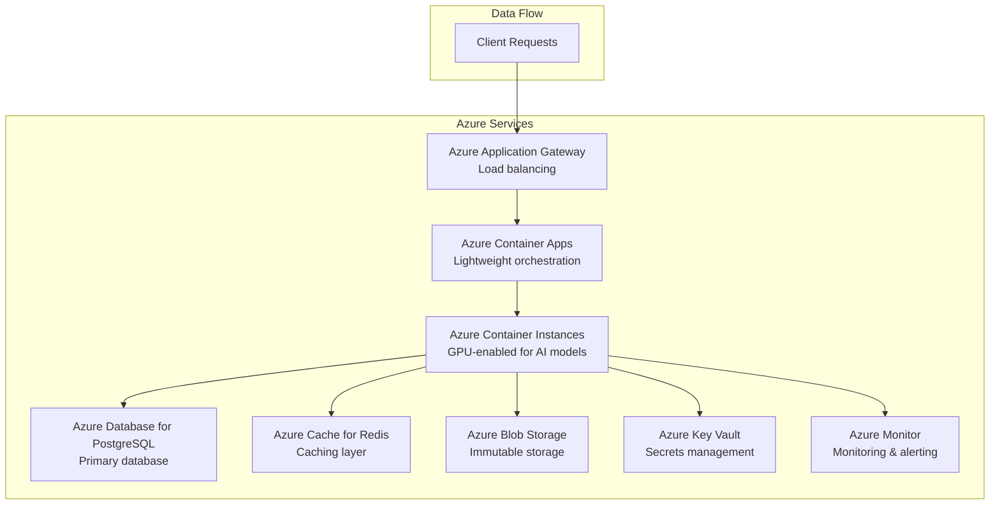

# Azure-Native Database Schema and Models Documentation

## Table of Contents

1. [Overview](#overview)
2. [Azure Services Architecture](#azure-services-architecture)
3. [Database Schema Design](#database-schema-design)
4. [Data Models](#data-models)
5. [Azure Service Integration](#azure-service-integration)
6. [Performance Optimization](#performance-optimization)
7. [Security and Compliance](#security-and-compliance)
8. [Monitoring and Observability](#monitoring-and-observability)
9. [Deployment Guide](#deployment-guide)
10. [Maintenance and Operations](#maintenance-and-operations)

## Overview

This document provides comprehensive documentation for the Azure-native **multi-database architecture** used in the Comply-AI platform. The design leverages Azure's managed services with a sophisticated database separation strategy for optimal performance, security, and scalability.

### Multi-Database Architecture

The Comply-AI platform uses a **three-database architecture** to provide better security, performance, and scalability:

```
┌─────────────────────────────────────────────────────────────┐
│                    Azure Database for PostgreSQL            │
├─────────────────────────────────────────────────────────────┤
│  ┌─────────────────┐  ┌─────────────────┐  ┌─────────────────┐ │
│  │   Core Database │  │  Billing DB     │  │  Analytics DB   │ │
│  │                 │  │                 │  │                 │ │
│  │ • Users         │  │ • Subscriptions │  │ • Usage Metrics │ │
│  │ • Tenants       │  │ • Invoices      │  │ • Performance   │ │
│  │ • Storage       │  │ • Payments      │  │ • Reports       │ │
│  │ • Audit Logs    │  │ • White-Glove   │  │ • Dashboards    │ │
│  │ • Configs       │  │ • Services      │  │ • ML Metrics    │ │
│  └─────────────────┘  └─────────────────┘  └─────────────────┘ │
└─────────────────────────────────────────────────────────────┘
```

### Database Breakdown

#### 1. Core Database (`comply-ai-core`)
- **Purpose**: Core application data and service operations
- **Tables**: 30 tables - Users, tenants, storage records, audit logs, configurations, support tickets, knowledge base, API keys, data retention
- **Access**: Application services, admin users
- **Backup**: Daily backups, 7-day retention

#### 2. Billing Database (`comply-ai-billing`)
- **Purpose**: Billing, subscriptions, and white-glove services
- **Tables**: 18 tables - Subscriptions, invoices, payments, white-glove services, training sessions, SLA metrics, customer satisfaction
- **Access**: Billing team, success managers, admin users
- **Backup**: Daily backups, 30-day retention (compliance requirement)

#### 3. Analytics Database (`comply-ai-analytics`)
- **Purpose**: Analytics, reporting, and performance metrics
- **Tables**: 23 tables - Usage metrics, performance data, compliance reports, Azure infrastructure, support metrics, customer success, feature usage
- **Access**: Analytics team, data scientists, admin users
- **Backup**: Daily backups, 7-day retention

### Key Features

- **Multi-Database Architecture**: Separated databases for security and performance
- **Azure Database for PostgreSQL**: Primary database with advanced features
- **Azure Cache for Redis**: High-performance caching layer
- **Azure Blob Storage**: Immutable storage with WORM compliance
- **Azure Key Vault**: Secure secrets management
- **Azure Monitor**: Comprehensive monitoring and alerting
- **Azure Container Registry**: Container image storage and management
- **Azure Virtual Network**: Network infrastructure tracking
- **Azure Application Gateway**: Load balancing and SSL termination
- **Azure Backup Vault**: Backup and disaster recovery
- **Azure Security Center**: Security monitoring and compliance
- **Multi-tenant Architecture**: Secure tenant isolation
- **Compliance Ready**: SOC2, ISO27001, HIPAA support
- **White-Glove Services**: Comprehensive service management system

## Azure Services Architecture

### Service Overview



### Resource Configuration

| Service | Tier | Configuration | Monthly Cost |
|---------|------|---------------|--------------|
| Azure Database for PostgreSQL | General Purpose D4s_v3 | 4 vCPUs, 16GB RAM, 100GB storage | ~$200 |
| Azure Cache for Redis | Standard C2 | 2 vCores, 3.5GB memory | ~$60 |
| Azure Blob Storage | Standard LRS | Hot tier, 1TB storage | ~$20 |
| Azure Key Vault | Standard | 1000 operations/month | ~$5 |
| Azure Monitor | Standard | 5GB logs/month | ~$25 |
| Azure Container Registry | Basic | 10GB storage, 1GB/day pull | ~$5 |
| Azure Virtual Network | Standard | 1 VNet, 5 subnets | ~$0 |
| Azure Application Gateway | Standard_v2 | Medium size, 2 instances | ~$25 |
| Azure Backup Vault | Standard | 1TB backup storage | ~$10 |
| Azure Security Center | Standard | Security monitoring | ~$15 |
| Azure Log Analytics | PerGB2018 | 5GB logs/month | ~$25 |
| Azure Application Insights | Standard | 5GB telemetry/month | ~$20 |

## Database Schema Design

### Azure Infrastructure Tables

The database schema includes comprehensive tracking for all Azure services used in the deployment:

#### Azure Container Registry
- **Table**: `azure_container_registries`
- **Purpose**: Track container image storage and management
- **Key Fields**: registry_name, login_server, sku, admin_enabled

#### Azure Virtual Network
- **Table**: `azure_virtual_networks`
- **Purpose**: Track network infrastructure and configuration
- **Key Fields**: vnet_name, address_space, dns_servers

#### Azure Subnets
- **Table**: `azure_subnets`
- **Purpose**: Track subnet configuration and associations
- **Key Fields**: subnet_name, address_prefix, network_security_group_id

#### Azure Network Security Groups
- **Table**: `azure_network_security_groups`
- **Purpose**: Track security rules and network policies
- **Key Fields**: nsg_name, security_rules (JSONB)

#### Azure Application Gateway
- **Table**: `azure_application_gateways`
- **Purpose**: Track load balancer configuration and routing
- **Key Fields**: gateway_name, sku, capacity, backend_pools, routing_rules

#### Azure Backup Vault
- **Table**: `azure_backup_vaults`
- **Purpose**: Track backup policies and protected items
- **Key Fields**: vault_name, storage_type, backup_policies

#### Azure Managed Identities
- **Table**: `azure_managed_identities`
- **Purpose**: Track identity management and role assignments
- **Key Fields**: identity_name, principal_id, client_id, role_assignments

#### Azure Log Analytics Workspaces
- **Table**: `azure_log_analytics_workspaces`
- **Purpose**: Track log aggregation and retention policies
- **Key Fields**: workspace_name, workspace_id, retention_days, sku

#### Azure Application Insights
- **Table**: `azure_application_insights`
- **Purpose**: Track application monitoring and telemetry
- **Key Fields**: app_name, app_id, instrumentation_key, sampling_percentage

#### Azure Security Center
- **Table**: `azure_security_center`
- **Purpose**: Track security monitoring and compliance assessments
- **Key Fields**: subscription_id, pricing_tier, security_alerts, compliance_assessments

### Service-Specific Tables

The database schema includes dedicated tables for each of the three main services:

#### Detector Orchestration Service Tables

**orchestration_requests** - Track orchestration requests and job management
- `request_id`, `job_id`, `tenant_id`, `content`, `content_type`
- `policy_bundle`, `environment`, `processing_mode`, `priority`
- `metadata`, `required_detectors`, `excluded_detectors`, `idempotency_key`

**orchestration_responses** - Store orchestration results and performance metrics
- `request_id`, `detector_results`, `aggregated_payload`, `mapping_result`
- `total_processing_time_ms`, `detectors_attempted`, `detectors_succeeded`
- `coverage_achieved`, `routing_decision`, `fallback_used`

**detector_results** - Individual detector execution results
- `request_id`, `detector`, `status`, `output`, `metadata`
- `error`, `processing_time_ms`, `confidence`

**routing_plans** - Detector routing and orchestration strategies
- `plan_name`, `primary_detectors`, `secondary_detectors`
- `parallel_groups`, `sequential_dependencies`, `timeout_config`
- `coverage_method`, `weights`, `required_taxonomy_categories`

#### Analysis Module Service Tables

**analysis_requests** - Track analysis requests and metrics
- `request_id`, `tenant_id`, `period`, `metrics`, `evidence_refs`
- `analysis_type`, `priority`, `metadata`, `idempotency_key`

**analysis_responses** - Store analysis results and recommendations
- `request_id`, `explanation`, `remediation_steps`, `policy_recommendations`
- `confidence`, `analysis_metadata`, `version_info`
- `processing_time_ms`, `model_used`, `template_fallback_used`

**analysis_metrics** - Store structured metrics for analysis
- `tenant_id`, `metric_name`, `metric_value`, `metric_unit`
- `time_period`, `evidence_refs`, `metadata`

**analysis_templates** - Analysis templates and fallback content
- `template_name`, `template_type`, `template_content`, `version`
- `is_active`, `metadata`

#### Llama Mapper Service Tables

**mapper_requests** - Track mapping requests (additional to storage_records)
- `request_id`, `tenant_id`, `detector`, `source_data`, `model_version`
- `processing_mode`, `priority`, `metadata`, `idempotency_key`

**mapper_responses** - Store mapping results and provenance
- `request_id`, `taxonomy`, `scores`, `confidence`, `notes`
- `provenance`, `policy_context`, `version_info`
- `processing_time_ms`, `model_used`

### User Management and Billing Tables

The database schema includes comprehensive user management and billing functionality with Stripe integration:

#### User Management Tables

**users** - User account management and authentication
- `user_id`, `email`, `password_hash`, `first_name`, `last_name`
- `company`, `phone`, `is_active`, `is_verified`, `email_verified_at`
- `last_login_at`, `azure_region`, `resource_group`

**user_roles** - Role-based access control (RBAC)
- `role_name`, `description`, `permissions` (JSONB), `is_system_role`

**user_role_assignments** - User role assignments per tenant
- `user_id`, `role_name`, `tenant_id`, `assigned_by`, `assigned_at`
- `expires_at`, `is_active`

**user_sessions** - User session management and tracking
- `session_id`, `user_id`, `tenant_id`, `ip_address`, `user_agent`
- `expires_at`, `last_accessed_at`

#### Billing and Subscription Tables

**billing_plans** - Subscription plans with Stripe integration
- `plan_id`, `plan_name`, `plan_type` (free/trial/paid/enterprise)
- `price_monthly`, `price_yearly`, `currency`, `features` (JSONB)
- `limits` (JSONB), `stripe_price_id`, `stripe_product_id`

**user_subscriptions** - User subscription management
- `subscription_id`, `user_id`, `tenant_id`, `plan_id`, `status`
- `billing_cycle`, `current_period_start/end`, `trial_start/end`
- `stripe_subscription_id`, `stripe_customer_id`

**usage_records** - Usage tracking for billing
- `user_id`, `tenant_id`, `subscription_id`, `usage_type`
- `usage_amount`, `usage_unit`, `billing_period_start/end`

**billing_invoices** - Invoice and payment tracking
- `invoice_id`, `user_id`, `tenant_id`, `subscription_id`
- `invoice_number`, `status`, `amount_due`, `amount_paid`
- `stripe_invoice_id`, `stripe_payment_intent_id`

**payment_methods** - Payment method management
- `payment_method_id`, `user_id`, `tenant_id`, `type`
- `stripe_payment_method_id`, `card_last_four`, `card_brand`
- `billing_address` (JSONB)

#### Free Tier and Promotional Tables

**free_tier_usage** - Free tier usage limits and tracking
- `user_id`, `tenant_id`, `usage_type`, `current_usage`
- `usage_limit`, `reset_period`, `next_reset_at`

**promotional_codes** - Promotional codes and discounts
- `code`, `description`, `discount_type`, `discount_value`
- `max_uses`, `current_uses`, `valid_from/until`, `applicable_plans`

**promotional_code_usage** - Promotional code usage tracking
- `code`, `user_id`, `subscription_id`, `used_at`, `discount_applied`

### Core Tables

#### 1. storage_records

Primary table for storing mapping results with Azure-specific optimizations.

```sql
CREATE TABLE storage_records (
    id UUID PRIMARY KEY DEFAULT gen_random_uuid(),
    source_data TEXT NOT NULL,
    mapped_data JSONB NOT NULL,
    model_version VARCHAR(100) NOT NULL,
    timestamp TIMESTAMPTZ NOT NULL DEFAULT NOW(),
    metadata JSONB,
    tenant_id VARCHAR(100) NOT NULL,
    s3_key VARCHAR(500),
    encrypted BOOLEAN DEFAULT FALSE,
    created_at TIMESTAMPTZ DEFAULT NOW(),
    expires_at TIMESTAMPTZ DEFAULT NOW() + INTERVAL '90 days',
    
    -- Azure-specific fields
    azure_region VARCHAR(50) DEFAULT 'eastus',
    resource_group VARCHAR(100) DEFAULT 'comply-ai-rg',
    subscription_id VARCHAR(100)
);

-- Performance indexes
CREATE INDEX CONCURRENTLY idx_storage_records_tenant_timestamp 
    ON storage_records(tenant_id, timestamp DESC);
CREATE INDEX CONCURRENTLY idx_storage_records_model_version 
    ON storage_records(model_version);
CREATE INDEX CONCURRENTLY idx_storage_records_expires_at 
    ON storage_records(expires_at) WHERE expires_at IS NOT NULL;

-- Row Level Security
ALTER TABLE storage_records ENABLE ROW LEVEL SECURITY;
CREATE POLICY tenant_isolation_policy ON storage_records
    FOR ALL USING (tenant_id = current_setting('app.current_tenant_id', true));
```

#### 2. audit_logs

Comprehensive audit trail for compliance reporting.

```sql
CREATE TABLE audit_logs (
    id BIGSERIAL PRIMARY KEY,
    tenant_id VARCHAR(255) NOT NULL,
    user_id VARCHAR(255),
    action VARCHAR(255) NOT NULL,
    resource_type VARCHAR(255) NOT NULL,
    resource_id VARCHAR(255),
    details JSONB,
    ip_address INET,
    user_agent TEXT,
    azure_region VARCHAR(50) DEFAULT 'eastus',
    subscription_id VARCHAR(100),
    resource_group VARCHAR(100),
    created_at TIMESTAMPTZ DEFAULT NOW()
);

-- Audit indexes
CREATE INDEX CONCURRENTLY idx_audit_logs_tenant_created 
    ON audit_logs(tenant_id, created_at DESC);
CREATE INDEX CONCURRENTLY idx_audit_logs_action 
    ON audit_logs(action);
CREATE INDEX CONCURRENTLY idx_audit_logs_resource_type 
    ON audit_logs(resource_type);
```

#### 3. tenant_configs

Tenant-specific configuration with Azure resource mapping.

```sql
CREATE TABLE tenant_configs (
    id BIGSERIAL PRIMARY KEY,
    tenant_id VARCHAR(255) UNIQUE NOT NULL,
    config_data JSONB NOT NULL,
    azure_subscription_id VARCHAR(100),
    azure_resource_group VARCHAR(100),
    azure_region VARCHAR(50) DEFAULT 'eastus',
    azure_key_vault_url VARCHAR(500),
    created_at TIMESTAMPTZ DEFAULT NOW(),
    updated_at TIMESTAMPTZ DEFAULT NOW()
);

CREATE INDEX CONCURRENTLY idx_tenant_configs_tenant_id 
    ON tenant_configs(tenant_id);
```

#### 4. model_versions

Model version tracking with Azure Blob Storage integration.

```sql
CREATE TABLE model_versions (
    id BIGSERIAL PRIMARY KEY,
    model_name VARCHAR(255) NOT NULL,
    version VARCHAR(255) NOT NULL,
    model_path TEXT NOT NULL,
    azure_blob_url VARCHAR(500),
    azure_container_name VARCHAR(100),
    checksum VARCHAR(255),
    is_active BOOLEAN DEFAULT FALSE,
    azure_region VARCHAR(50) DEFAULT 'eastus',
    created_at TIMESTAMPTZ DEFAULT NOW(),
    activated_at TIMESTAMPTZ
);

CREATE INDEX CONCURRENTLY idx_model_versions_model_name 
    ON model_versions(model_name);
CREATE INDEX CONCURRENTLY idx_model_versions_is_active 
    ON model_versions(is_active);
```

### Partitioning Strategy

For large-scale deployments, implement table partitioning:

```sql
-- Partition storage_records by tenant_id
CREATE TABLE storage_records_partitioned (
    LIKE storage_records INCLUDING ALL
) PARTITION BY HASH (tenant_id);

-- Create partitions
CREATE TABLE storage_records_p0 PARTITION OF storage_records_partitioned
    FOR VALUES WITH (modulus 4, remainder 0);
CREATE TABLE storage_records_p1 PARTITION OF storage_records_partitioned
    FOR VALUES WITH (modulus 4, remainder 1);
CREATE TABLE storage_records_p2 PARTITION OF storage_records_partitioned
    FOR VALUES WITH (modulus 4, remainder 2);
CREATE TABLE storage_records_p3 PARTITION OF storage_records_partitioned
    FOR VALUES WITH (modulus 4, remainder 3);

-- Partition audit_logs by month
CREATE TABLE audit_logs_partitioned (
    LIKE audit_logs INCLUDING ALL
) PARTITION BY RANGE (created_at);

CREATE TABLE audit_logs_2024_01 PARTITION OF audit_logs_partitioned
    FOR VALUES FROM ('2024-01-01') TO ('2024-02-01');
```

## Data Models

### Core Models

#### AzureStorageRecord

```python
from dataclasses import dataclass
from datetime import datetime
from typing import Any, Dict, Optional
import uuid

@dataclass
class AzureStorageRecord:
    """Azure-optimized storage record with region and subscription tracking."""
    id: uuid.UUID
    source_data: str
    mapped_data: Dict[str, Any]
    model_version: str
    timestamp: datetime
    metadata: Dict[str, Any]
    tenant_id: str
    s3_key: Optional[str] = None
    encrypted: bool = False
    created_at: Optional[datetime] = None
    expires_at: Optional[datetime] = None
    
    # Azure-specific fields
    azure_region: str = "eastus"
    resource_group: str = "comply-ai-rg"
    subscription_id: Optional[str] = None
    blob_url: Optional[str] = None
    container_name: str = "mapper-outputs"
```

#### AzureAuditRecord

```python
@dataclass
class AzureAuditRecord:
    """Azure-compliant audit record with resource tracking."""
    event_id: str
    tenant_id: str
    user_id: Optional[str] = None
    action: str = ""
    resource_type: str = ""
    resource_id: Optional[str] = None
    details: Dict[str, Any] = None
    ip_address: Optional[str] = None
    user_agent: Optional[str] = None
    
    # Azure-specific fields
    azure_region: str = "eastus"
    subscription_id: Optional[str] = None
    resource_group: str = "comply-ai-rg"
    timestamp: datetime = None
    
    def __post_init__(self):
        if self.timestamp is None:
            self.timestamp = datetime.utcnow()
        if self.details is None:
            self.details = {}
```

### Configuration Models

#### AzureStorageConfig

```python
from pydantic import BaseModel, Field
from typing import Optional

class AzureStorageConfig(BaseModel):
    """Azure Blob Storage configuration."""
    storage_account: str = Field(..., description="Azure Storage Account name")
    container_name: str = Field(default="mapper-outputs", description="Container name")
    access_key: Optional[str] = Field(None, description="Storage account access key")
    connection_string: Optional[str] = Field(None, description="Storage connection string")
    sas_token: Optional[str] = Field(None, description="SAS token for access")
    endpoint_url: Optional[str] = Field(None, description="Custom endpoint URL")
    region: str = Field(default="eastus", description="Azure region")

class AzureDatabaseConfig(BaseModel):
    """Azure Database for PostgreSQL configuration."""
    host: str = Field(..., description="Database host")
    port: int = Field(default=5432, description="Database port")
    database: str = Field(..., description="Database name")
    username: str = Field(..., description="Database username")
    password: Optional[str] = Field(None, description="Database password")
    ssl_mode: str = Field(default="require", description="SSL mode")
    connection_pool_size: int = Field(default=10, description="Connection pool size")
    max_overflow: int = Field(default=20, description="Max overflow connections")
    region: str = Field(default="eastus", description="Azure region")
```

## Azure Service Integration

### Redis Configuration

```python
# Redis key patterns for Azure Cache for Redis
REDIS_KEY_PATTERNS = {
    "model_response": "mapper:response:{tenant_id}:{detector_hash}",
    "detector_result": "detector:result:{tenant_id}:{content_hash}",
    "tenant_config": "config:tenant:{tenant_id}",
    "model_config": "config:model:{model_name}:{version}",
    "user_session": "session:user:{user_id}",
    "rate_limit": "rate:limit:{tenant_id}:{endpoint}",
    "circuit_breaker": "circuit:breaker:{service_name}",
    "health_check": "health:{service_name}:{instance_id}",
}

# Redis configuration
REDIS_CONFIG = {
    "host": "comply-ai-redis.redis.cache.windows.net",
    "port": 6380,
    "password": "your-redis-primary-key",
    "ssl": True,
    "db": 0,
    "max_connections": 50,
    "retry_on_timeout": True,
    "socket_timeout": 5,
    "socket_connect_timeout": 5,
    "health_check_interval": 30,
}
```

### Blob Storage Configuration

```python
# Azure Blob Storage structure
BLOB_STORAGE_CONFIG = {
    "storage_account": "complyaistorage",
    "container_name": "mapper-outputs",
    "blob_paths": {
        "mapping_results": "mappings/{tenant_id}/{year}/{month}/{day}/{record_id}.json",
        "model_artifacts": "models/{model_name}/{version}/{artifact_type}/{filename}",
        "audit_logs": "audit/{tenant_id}/{year}/{month}/{day}/{log_id}.json",
        "backups": "backups/{service_name}/{year}/{month}/{day}/{backup_id}.tar.gz",
        "training_data": "training/{model_name}/{version}/{dataset_type}/{filename}",
    },
    "retention_policy": {
        "mapping_results": "7_years",
        "audit_logs": "7_years", 
        "model_artifacts": "1_year",
        "backups": "1_year",
        "training_data": "6_months",
    },
    "access_tiers": {
        "hot": "immediate_access",
        "cool": "30_days",
        "archive": "90_days",
    }
}
```

## Performance Optimization

### Database Performance

```sql
-- Azure Database for PostgreSQL performance optimizations
ALTER SYSTEM SET shared_preload_libraries = 'pg_stat_statements';
ALTER SYSTEM SET track_activity_query_size = 2048;
ALTER SYSTEM SET pg_stat_statements.track = 'all';

-- Optimize for Azure workloads
ALTER SYSTEM SET shared_buffers = '256MB';
ALTER SYSTEM SET effective_cache_size = '1GB';
ALTER SYSTEM SET maintenance_work_mem = '64MB';
ALTER SYSTEM SET checkpoint_completion_target = 0.9;
ALTER SYSTEM SET wal_buffers = '16MB';
ALTER SYSTEM SET default_statistics_target = 100;

-- Enable connection pooling
ALTER SYSTEM SET max_connections = 200;
```

### Redis Performance

```python
# Azure Cache for Redis performance configuration
REDIS_PERFORMANCE_CONFIG = {
    "maxmemory_policy": "allkeys-lru",
    "maxmemory": "3gb",
    "tcp_keepalive": 60,
    "timeout": 0,
    "tcp_nodelay": True,
    "lazyfree_lazy_eviction": True,
    "lazyfree_lazy_expire": True,
    "lazyfree_lazy_server_del": True,
    "replica_lazy_flush": True,
}
```

### Blob Storage Performance

```python
# Azure Blob Storage performance optimization
BLOB_PERFORMANCE_CONFIG = {
    "max_concurrency": 4,
    "max_single_put_size": 100 * 1024 * 1024,  # 100MB
    "max_single_get_size": 100 * 1024 * 1024,  # 100MB
    "max_block_size": 4 * 1024 * 1024,  # 4MB
    "max_page_size": 4 * 1024 * 1024,  # 4MB
    "retry_total": 3,
    "retry_connect": 3,
    "retry_read": 3,
    "retry_status": 3,
    "retry_backoff_factor": 0.3,
    "retry_backoff_max": 10,
}
```

## Security and Compliance

### Tenant Isolation

- **Row Level Security (RLS)**: Database-level tenant isolation
- **Tenant Context**: Scoped operations with access level controls
- **Cross-tenant Prevention**: Strict isolation with audit logging

### Encryption

- **At Rest**: AES256 encryption for all stored data
- **In Transit**: TLS 1.3 for all communications
- **Key Management**: Azure Key Vault with rotation capabilities

### Compliance Features

- **Audit Trail**: Comprehensive logging for all operations
- **Data Lineage**: Track data flow through the system
- **Framework Mapping**: SOC2, ISO27001, HIPAA compliance
- **Retention Policies**: Configurable data retention

## Monitoring and Observability

### Azure Monitor Integration

```python
# Azure Monitor configuration
AZURE_MONITOR_CONFIG = {
    "workspace_id": "your-workspace-id",
    "application_insights_key": "your-app-insights-key",
    "custom_metrics": [
        "mapper_requests_total",
        "mapper_request_duration_ms",
        "database_connection_pool_size",
        "cache_hit_rate",
        "blob_storage_operations_total"
    ],
    "alerts": [
        {
            "name": "HighErrorRate",
            "condition": "error_rate > 1%",
            "duration": "5m"
        },
        {
            "name": "HighLatency",
            "condition": "p95_latency > 2s",
            "duration": "5m"
        }
    ]
}
```

### Key Metrics

- **Performance**: Response time, throughput, error rate
- **Resource Usage**: CPU, memory, storage, network
- **Business Metrics**: User activity, API usage, compliance status
- **Security**: Failed logins, privilege escalations, data access

## Deployment Guide

### Prerequisites

1. Azure subscription with appropriate permissions
2. Azure CLI installed and configured
3. Docker for container image building
4. Terraform for infrastructure as code (optional)

### Step 1: Create Azure Resources

```bash
# Create resource group
az group create --name comply-ai-rg --location eastus

# Create PostgreSQL server
az postgres flexible-server create \
  --resource-group comply-ai-rg \
  --name comply-ai-postgres \
  --location eastus \
  --admin-user complyaiadmin \
  --admin-password "YourSecurePassword123!" \
  --sku-name Standard_D4s_v3 \
  --tier GeneralPurpose \
  --storage-size 100 \
  --version 15

# Create Redis cache
az redis create \
  --resource-group comply-ai-rg \
  --name comply-ai-redis \
  --location eastus \
  --sku Standard \
  --vm-size c2

# Create storage account
az storage account create \
  --resource-group comply-ai-rg \
  --name complyaistorage \
  --location eastus \
  --sku Standard_LRS \
  --kind StorageV2

# Create Key Vault
az keyvault create \
  --resource-group comply-ai-rg \
  --name comply-ai-keyvault \
  --location eastus \
  --sku standard
```

### Step 2: Deploy Database Schema

```bash
# Connect to PostgreSQL and run schema
psql -h comply-ai-postgres.postgres.database.azure.com \
     -U complyaiadmin \
     -d llama_mapper \
     -f schema.sql
```

### Step 3: Configure Application

```bash
# Set environment variables
export LLAMA_MAPPER_STORAGE__DB_HOST=comply-ai-postgres.postgres.database.azure.com
export LLAMA_MAPPER_STORAGE__DB_USER=complyaiadmin
export LLAMA_MAPPER_STORAGE__DB_PASSWORD=YourSecurePassword123!
export LLAMA_MAPPER_STORAGE__S3_BUCKET=complyaistorage
export REDIS_HOST=comply-ai-redis.redis.cache.windows.net
export AZURE_KEY_VAULT_URL=https://comply-ai-keyvault.vault.azure.net/
```

## Maintenance and Operations

### Backup Strategy

- **Database**: Automated daily backups with point-in-time recovery
- **Blob Storage**: Geo-redundant storage with versioning
- **Configuration**: Key Vault backup and recovery procedures

### Monitoring

- **Health Checks**: Automated health monitoring for all services
- **Alerting**: Proactive alerting for performance and availability issues
- **Logging**: Centralized logging with Azure Monitor

### Scaling

- **Horizontal Scaling**: Auto-scaling based on demand
- **Vertical Scaling**: Resource optimization based on usage patterns
- **Cost Optimization**: Right-sizing resources for optimal cost-performance

### Security Updates

- **Regular Updates**: Automated security updates for all components
- **Vulnerability Scanning**: Regular security assessments
- **Access Reviews**: Periodic review of access permissions

## Troubleshooting

### Common Issues

1. **Database Connection Issues**
   - Check firewall rules and network connectivity
   - Verify connection string and credentials
   - Monitor connection pool usage

2. **Redis Connection Issues**
   - Verify SSL configuration
   - Check authentication credentials
   - Monitor memory usage and eviction policies

3. **Blob Storage Issues**
   - Verify storage account access keys
   - Check container permissions
   - Monitor storage quotas and limits

### Performance Issues

1. **Slow Queries**
   - Analyze query execution plans
   - Check index usage and optimization
   - Monitor database statistics

2. **High Memory Usage**
   - Check Redis memory configuration
   - Monitor cache hit rates
   - Optimize data structures

3. **Storage Performance**
   - Check blob storage tier configuration
   - Monitor storage account limits
   - Optimize blob access patterns

## Support and Resources

- **Azure Documentation**: https://docs.microsoft.com/azure/
- **PostgreSQL Documentation**: https://www.postgresql.org/docs/
- **Redis Documentation**: https://redis.io/documentation
- **Azure Support**: https://azure.microsoft.com/support/

For additional support or questions, please refer to the project documentation or contact the development team.
